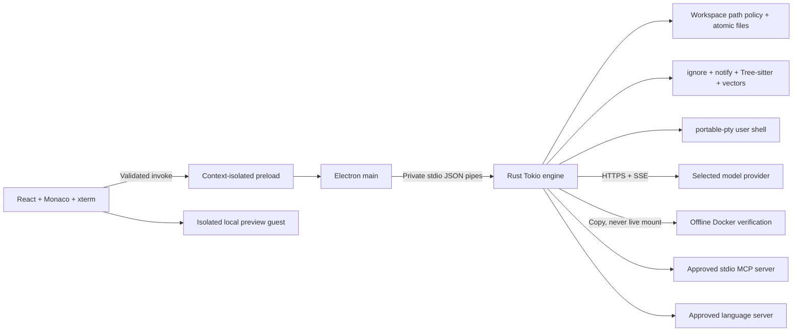

# Architecture and trust boundaries

## Transport

Requests are `{id, method, params}` JSON objects terminated by a newline. Responses contain `{id, result}` or `{id, error: {message}}`. Events contain `{event, data}`. Frames are limited to 8 MiB. Main correlates request IDs, enforces deadlines, rejects pending promises on disconnect and exposes only schema-validated methods to the renderer. There is no listening TCP port, shared auth token or browser-reachable sidecar endpoint.

The engine limits concurrent requests to 32, outgoing event buffering to 256 messages and agent operations to one at a time. PTY byte chunks are base64 encoded. SSE parsing buffers bytes until a complete line is available, preserving fragmented UTF-8. Cancellation tokens stop provider streams and verification. Closing stdin requests shutdown; cleanup stops peers, kills terminal sessions, and force-removes generated Docker containers. Main allows 15 seconds before a forced process kill.

Provider endpoints are fixed in native code. User-supplied model identifiers do not select arbitrary endpoint URLs. Full provider error bodies and credentials are not echoed to the renderer. API keys are loaded from the process environment or the OS-backed encrypted store and filtered from child-process environments.

## Filesystem and review

The selected workspace root is canonicalized once. Every file tool requires a relative forward-slash path, rejects traversal, Windows alternate data streams and protected `.git` components, rejects symlink paths and rechecks canonical containment. Unix hard links are rejected. Agent proposals additionally reject common sensitive paths and workspace rule edits. New-file writes create parents within the workspace and replace contents through a same-directory temporary file. File saves and plan application use exact-content preconditions.

These checks are a trusted-workspace guardrail, not an OS security boundary against a hostile local process racing filesystem operations. A production deployment that must withstand malicious concurrent filesystem mutation needs directory-handle-relative operations / platform-native file handle controls and adversarial tests. External processes can still edit files during a multi-file apply. Batch rollback is best effort; errors are explicit. No disk-backed recovery journal currently exists.

Plan parsing denies unknown JSON fields. Existing files can only be proposed if the exact original was supplied to the model. All changes retain original/proposed contents and unified diffs in engine memory. Approving the plan and accepting individual diffs are separate operations. Commands cannot be passed through arbitrary renderer RPC methods: native user input uses PTYs; agent verification uses only commands from an approved plan.

## Integrations

MCP peers use newline-delimited JSON-RPC and LSP peers use `Content-Length` framing. Messages have size and request-time limits. Unimplemented server-to-client requests receive an explicit method-not-found response. Local server launch and every MCP tool call have native approval dialogs; MCP executable permissions are the user's permissions.

Monaco workers and language assets ship locally. The renderer does not load Monaco from a CDN. The LSP client supports whole-document synchronization, basic completion and hover; it does not implement snippets, completion resolution, workspace edits, semantic tokens, or arbitrary server commands. Server configuration is session-local.

Preview guests have their own in-memory session partition. Electron main validates attachment options and navigation, disables Node/preload, denies permission requests and denies popups/downloads. Main accepts privileged IPC only from the owning window's top frame. A compromised preview guest does not receive the preload bridge.

## Release design

`electron-builder` packs renderer/main scripts into ASAR and places the executable in `resources/bin`. Each platform compiles its native Rust/C dependencies on matching hardware. macOS lists the sidecar as an additional binary for signing. Tagged builds require signing and macOS notarization; non-release builds produce unsigned test artifacts. Windows GNU builds may require toolchain runtime DLLs; official CI uses MSVC to avoid that distribution dependency.

Before a hosted SaaS launch, introduce a separate control plane: identity and organization membership, tenant authorization, quotas, metering/billing, short-lived credentials, revocation, server-side policy, audit retention, update delivery and region/data retention decisions. None of these can be safely inferred from a local IDE specification.

## Primary implementation references

- [Electron process sandboxing](https://www.electronjs.org/docs/latest/tutorial/sandbox)
- [Electron webview security options](https://www.electronjs.org/docs/latest/api/webview-tag)
- [electron-builder application contents / extraResources](https://www.electron.build/docs/contents/)
- [electron-builder code signing](https://www.electron.build/docs/features/code-signing/)
- [portable-pty API](https://docs.rs/portable-pty/latest/portable_pty/)
- [Tree-sitter TypeScript bindings](https://docs.rs/tree-sitter-typescript/latest/tree_sitter_typescript/)
- [Anthropic message streaming](https://platform.claude.com/docs/en/build-with-claude/streaming)
- [Gemini streaming generation](https://ai.google.dev/api/generate-content)
- [MCP 2025-03-26 lifecycle](https://modelcontextprotocol.io/specification/2025-03-26/basic/lifecycle)
